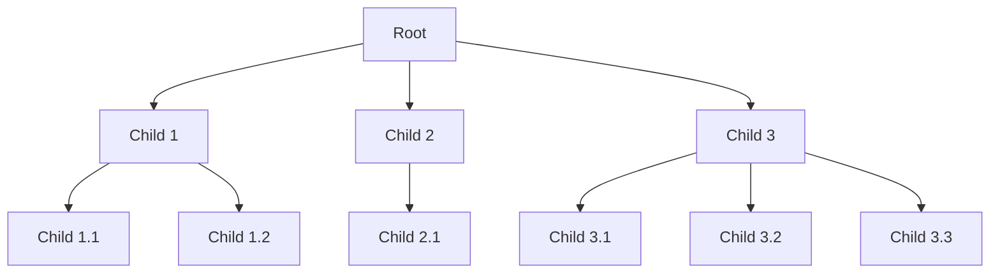
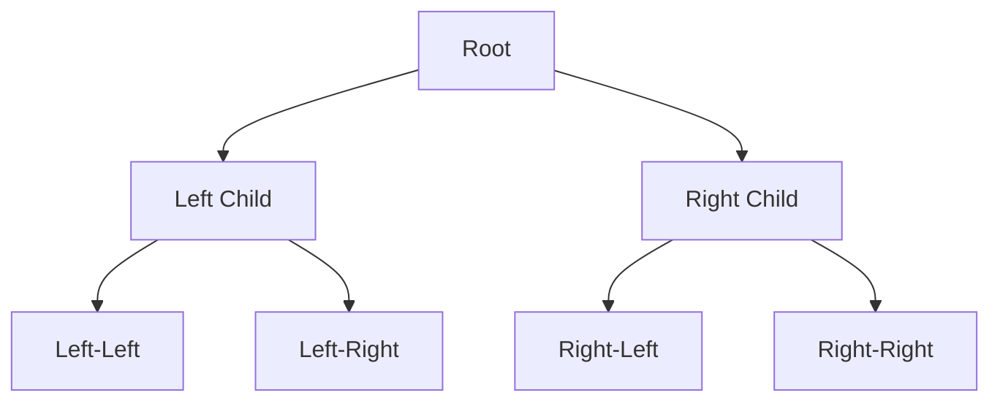
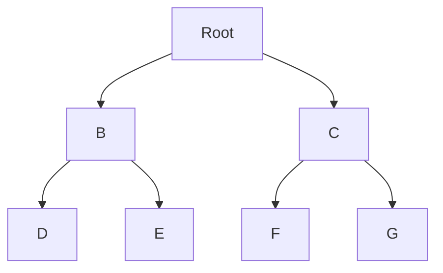

# Kap 1.2.11 Perfekte, komplette og fulle trær
## Trær
Et tre er en type grafstruktur hvor noder knyttes sammen til andre noder som kan være foreldre eller barn til/av noden. Man kan traversere trær opp eller ned mellom barn og foreldre. Den øverste noden har ingen forelder, og kalles rotnoten. De nederste nodene har ingen barn og kalles bladnoder. Det er kun én rotnode. En node kan kun ha én forelder, men gjerne flere barn.
Vi kaller avstanden til rotnoden for _nivået_ i treet. Rotnoden er på nivå 0. Nivå 1 er rotnodens barn, osv.

### Binære trær
I et binært tre kan nodene kun a 0, 1, eller 2 barn. Disse trærne er vanlige å bruke for hurtig søk i data. Dette er fordi nodene i treet kan ordnes slik at hvert steg nedover i treet eliminerer halvparten av mulige søkeresultater. Med andre ord kan vi(for sammenlignbar data) etablere et binært søketre som tillater søk med orden $\log_2n$.
Vi skiller på venstre og høyre barn av en node. Hvis det kun er ett barn av en node må denne noden være enten venstre eller høyre barn.

### Perfekte binære trær
Et binærtre er perfekt hvis alle nivåer inneholder så mange noder som det er plass til. Det vil si at antall noder i et perfekt binærtre kan bestemmes av høyden på treet. Et perfekt binært tre med høyde 4(Dvs. et tre hvor det finnes noder på nivå 4, men ikke nivå 5 eller høyere) har $1+2+4+8=15$ noder.
Generelt:

$$
k_n=\sum_{i=0}^{n-1}{2^i}=2^{n}-1
$$

### Komplette binære trær
Et komplett binært tre ligner på et perfekt binært tre, bortsett fra at det siste nivået ikke behøver å inneholde så mange noder som det er plass til. Det er imidlertid et krav at alle noder i nederste nivå enten er lengst til venstre(dvs venstre barn av noden lengst til venstre i nivået over), eller har en umiddelbar nabo til venstre. Vi kan si at treets siste nivå må være "fylt opp" fra venstre. Det kan ikke være "hull" uten noder mellom to noder i nederste lag.

### Fulle binære trær
Et fullt binært tre er slik at alle nodene i treet har enten 0 eller 2 barn.

### Maksimumstre
Et binærtre kalles et maksimumstre hvis verdien i hver node er større enn eller lik verdiene til nodens eventuelle barn.

### Maksimumsheap
Et komplett maksimumstre kalles en maksimumsheap.